### 시각화와 분석

### 순서
1. 시각화와 분석:

  1.1. 시각화의 원리.

  1.2. Seaborn 통계 시각화.

### 1.1. 시각화의 원리

시각화 : 목적

시각화의 목적:

- 가설과 가설 사이의 비교 목적.
- 데이터의 인과 관계, 상응 관계, 구조적 관계를 보여주려는 목적.
- 다변량 데이터를 요약해서 보여주려는 목적.
- 요약해서 보여주려는 목적.
- 분석 결과를 분석의 결론을 뒷받침하는 증거물로 제시하려는 목적.

      컨텐츠(스토리)의 유/무가 시각화의 효과를 결정한다!

탐색적 시각화의 목적 :

- 데이터의 통계적 특성 을 알아보려는 목적 .
- 데이터에 패턴이 있는지 육안으로 확인해 보려는 목적 .
- 향후 분석 방향을 정하려는 목적 .
- 결과를 보고하려는 목적 .

탐색적 시각화의 특징 :

- 분석가 본인의 직관적인 이해를 우선시 한다 .
- 많은 노력을 들이지 않고 짧은 시간안에 완성한다 .
- 많은 수의 그래프 생성한다 .
- 타이틀, 레이블 등은 크게 중요하지 않다 .
- 컬러, 폰트, 등은 꼭 필요할 때만 사용한다 .

시각화: 용도와 유형

용도와 유형 :

- 단변량 기술통계 요약 :상자그림(boxplot), 히스토그램(histogram), 막대그림(bar chart), 파이(pie), 등.
  - 연속형 변수 1개를 사용한다 .
  - Box, Whiskers, Outliers로 구성된다 .

  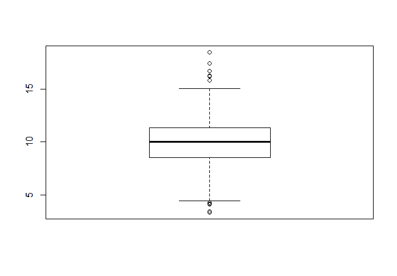

시각화 : 용도와 유형

시각화 용도와 유형:

- 단변량 기술통계 요약: 상자그림(boxplot), 히스토그램(histogram), 막대그림(barchart), 파이(pie), 등.
  - 연속형 변수 1개를 사용한다.
  - 각 계급에 해당하는 자료의 도수(count)를 보여준다.

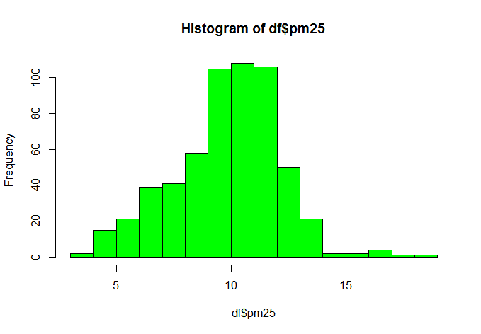

시각화 용도와 유형:

- 단변량 기술통계 요약: 상자그림(boxplot), 히스토그램(histogram), 막대그림 (barchart), 파이(pie), 등.
- 계급의 크기를 조정해 줄 수 있다.

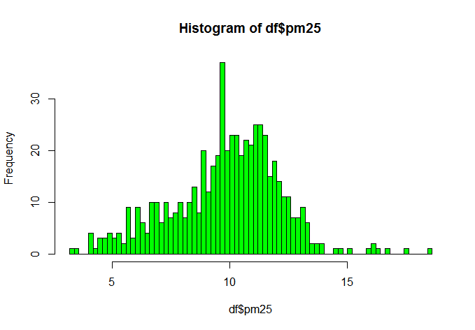

시각화 용도와 유형:

- 단변량 기술통계 요약: 상자그림 (boxplot), 히스토그램(histogram), 막대그림 (bar chart), 파이(pie), 등.
  - 명목형 변수 1개를 사용한다 .
  - 명목형 변수 유형별 도수 (count)를 보여준다.

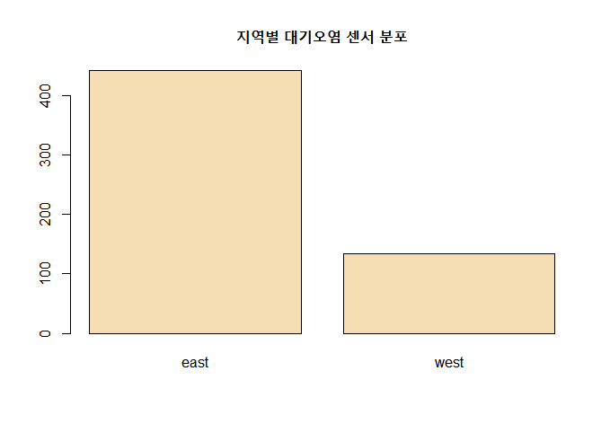

용도와 유형:

- 단변량 기술통계 요약: 상자그림 (boxplot), 히스토그램(histogram), 막대그림 (bar chart), 파이(pie),등.
  - 명목형 변수 1개를 사용한다.
  - 명목형 변수 유형별 상대 도수 (비율)를 보여준다.

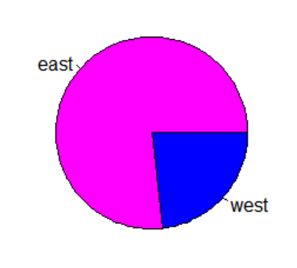

시각화 용도와 유형:

- 비교, 상관관계 확인: 산점도, 다중 산점도, 다중 히스토그램, 다중 상자그림, 등.
  - 기본적으로 연속형 변수 2개를 사용한다: X와 Y.
  - 두개의 연속형 변수 사이의 관계를 보여준다: X=독립 ,Y=종속.

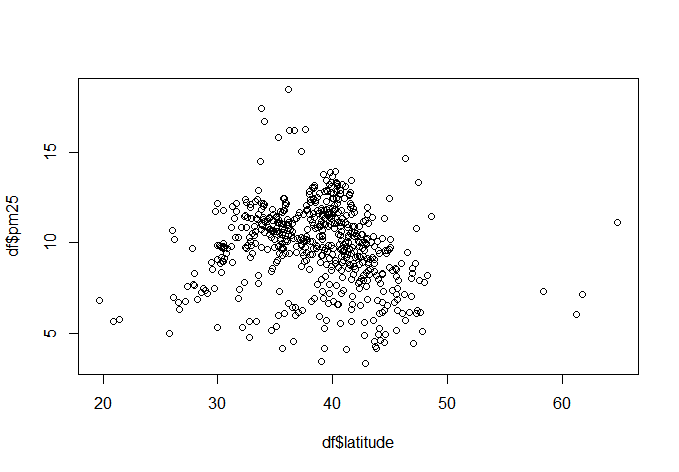

시각화 용도와 유형:

- 비교, 상관관계 확인: 산점도, 다중 산점도, 다중 히스토그램, 다중 상자그림, 등.
  - 연속형 변수 2개 이외에 명목형 변수가 1개 있다면 색상으로 표현할 수 있다.

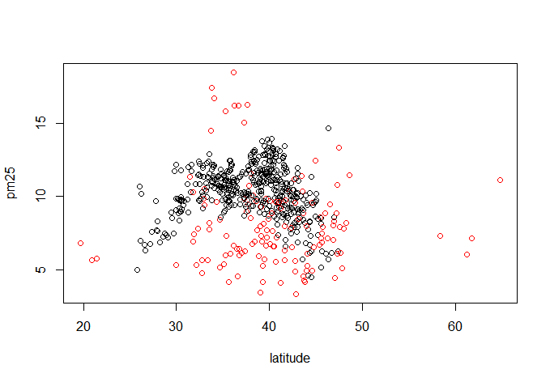

용도와 유형:

- 비교, 상관관계 확인: 산점도, 다중 산점도, 다중 히스토그램, 다중 상자그림, 등.
  - 연속형 변수 2개 이외에 명목형 변수가 1개 있다면 여러 개의 산점도로 나누어서 표현할 수 있다.
  - 산점도의 수=명목형 변수 유형의 수.

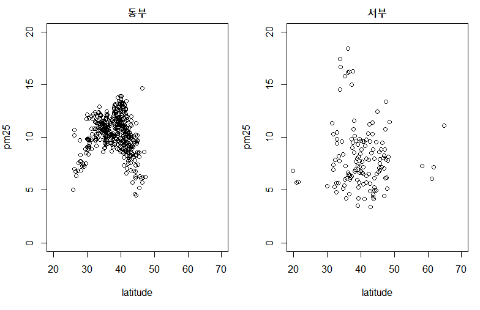

용도와 유형:

- 비교, 상관관계 확인: 산점도, 다중 산점도, 다중 히스토그램, 다중 상자그림, 등.
  - 명목형 변수 1개+연속형 변수 1개를 사용한다.
  - 히스토그램의 수=명목형 변수 유형의 수.

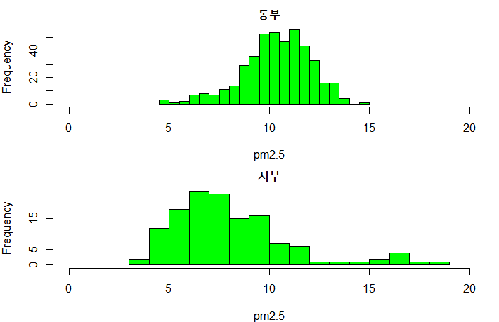

시각화 용도와 유형:

- 비교, 상관관계 확인: 산점도, 다중 산점도, 다중 히스토그램, 다중 상자그림, 등.
  - 명목형 변수 1개+연속형 변수 1개를 사용한다 .
  - 상자 그림의 수=명목형 변수 유형의 수.

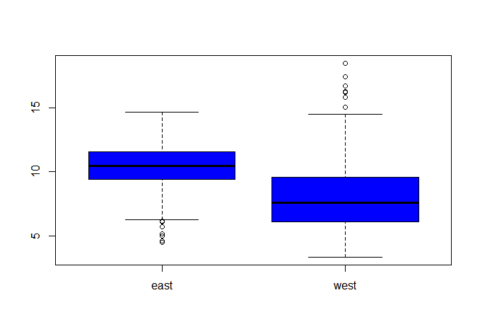
시각화와 착시현상 :
- A사의 분기별 매출 현황을 다음과 같이 막대그림으로 표현해 본다.=> 호황?

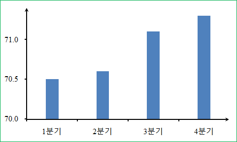

시각화와 착시현상:

- 세로축 스케일을 조정하여 전체를 보여주도록 만든다.=> 대략 2%매출 증가!

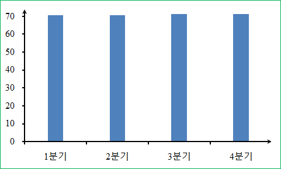

시각화와 착시현상:

- 3D파이차트에서는 상대적 비율을 분간하기 힘들다!
- 3D파이차트 에서는 원근법 때문에 매우 큰 착시현상이 발생한다!

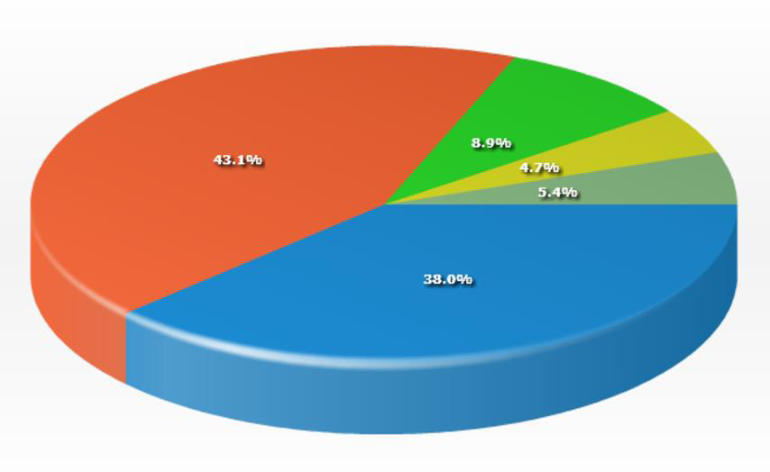

착시현상:

- 3D파이차트에서는 상대적 비율을 분간하기 힘들다!
- 3D파이차트 에서는 원근법 때문에 매우 큰 착시현상이 발생한다!

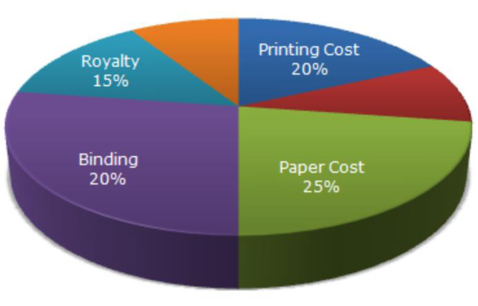

### [seaborn](https://seaborn.pydata.org/)
1.2. Seaborn통계 시각화.

Seaborn 라이브러리 : 개요

Seaborn의 주요기능:
- 내장 데이터: load_dataset().
- 기본 시각화 유형: histplot(), displot(), scatterplot(), jointplot(), kdeplot(),boxplot(), barplot(), countplot(), 등.
- 시각화 행렬 유형: pairplot(), PairGrid(), FacetGrid(), 등.
- 회귀선 추가 기능: lmplot(), jointplot(), 등.
- 2D특수 시각화: heatmap(), clustermap(), 등.
- 기본 시각화의 변형: violinplot(), swarmplot(), stripplot(), 등.

관련 사이트: https://seaborn.pydata.org

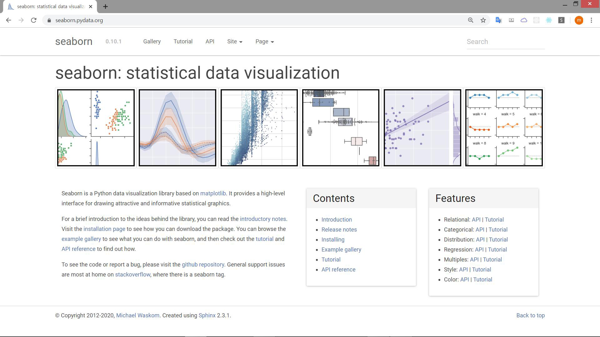

Seaborn의 내장 데이터: https://github.com/mwaskom/seaborn-data

|명칭|내용|
|---|---|
|mpg|자동차 연비 데이터.|
|iris|붓꽃 데이터.|
|titanic|타이태닉호 데이터.|
|diamonds|다이아몬드의 스펙과 가격 데이터.
|car_crashes|자동차 사고 관련 데이터.|
|flights|1949~1960 사이의 항공기 운항 횟수 데이터.|
|geyser|"Old Faithful" 간헐천 분출 주기 데이터.|

=> 제공되는 데이터셋 중 일부만 간추림.

히스토그램:

fig=sns.histplot(data=df, x='mpg', bins=50, color='turquoise')

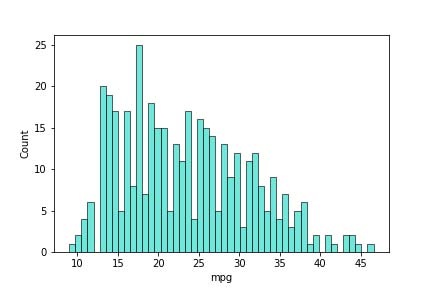

히스토그램: 다른 방법.

fig=sns.displot(data=df, x='mpg', kde=False, rug=False, bins=50, color='red', kind='hist')

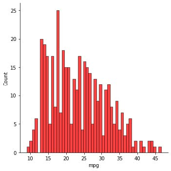

히스토그램+Rug:

fig=sns.displot(data=df, x='mpg', kde=False, rug=True, bins=50, color='blue', kind='hist')

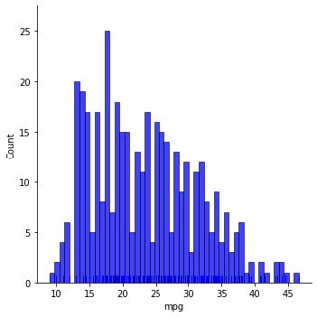

산점도:기본형.

fig=sns.scatterplot(dat=df, x='weight', y='mpg', color='red')

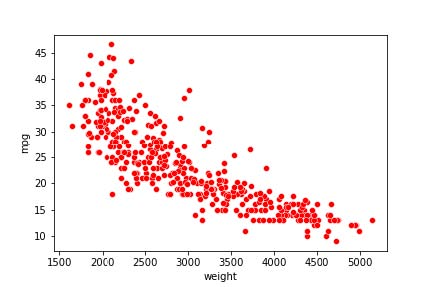

산점도: 다른 방법.

fig=sns.jointplot(data=df,x='weight',y='mpg',color='red',kind='scatter')

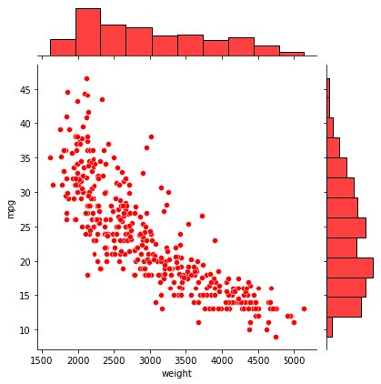

산점도+회귀선:

fig=sns.jointplot(data=df,x='weight',y='mpg',color='orange',kind='reg')

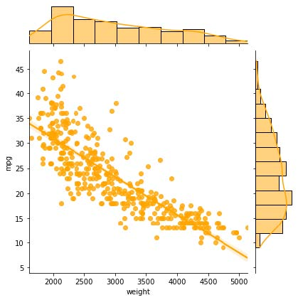

Hex:

fig=sns.jointplot(data=df,x='weight',y='mpg',color='green',kind='hex')

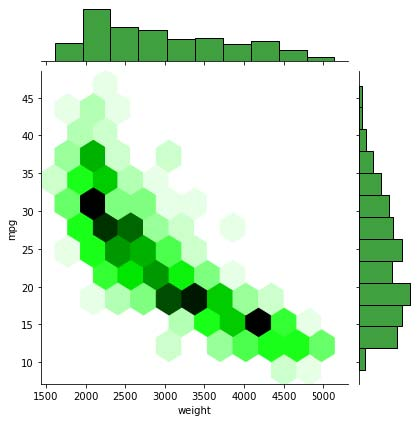

KDE(Kernel Density Estimation):

fig=sns.jointplot(data=df,x='weight',y='mpg',color='blue',kind='kde')

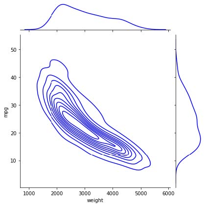

막대그림: 유형별 집계.

fig=sns.barplot(data=df,x='origin',y='mpg',ci=False)

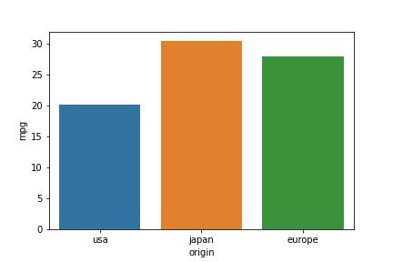

막대그림: 도수표.

fig=sns.countplot(data=df,x='origin',palette='coolwarm')

막대그림: 도수표+제2의 명목형 변수.

fig=sns.countplot(data=df,x='origin',hue='cylinders')

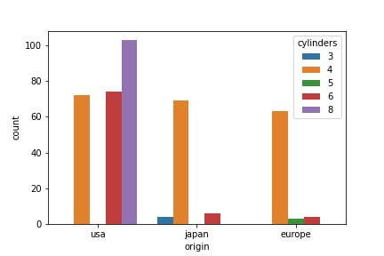

상자그림: 세로 방향.

fig=sns.boxplot(data=df,x='origin',y='mpg',palette='coolwarm',notch=True)

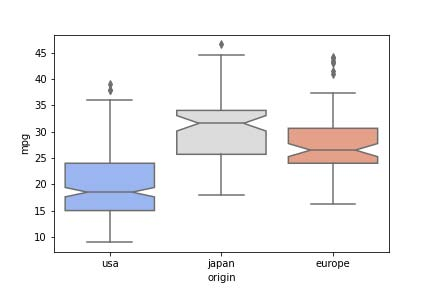

상자그림: 가로 방향.

fig=sns.boxplot(data=df,x='mpg',y='origin',palette='coolwarm',notch=True)

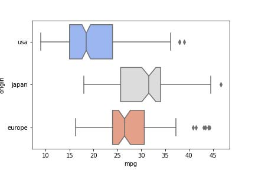

다중 상자그림: hue 인자를 사용.

fig=sns.boxplot(data=df,x='origin',y='mpg',hue='cylinders')

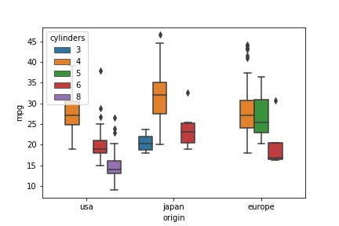

바이올린: 상자그림과 인자가 같음.

fig=sns.violinplot(data=df,x='origin',y='mpg',palette='coolwarm')

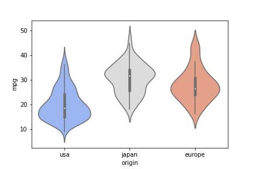

Swarm:

fig=sns.swarmplot(data=df,x='cylinders',y='horsepower',palette='coolwarm',size=2)

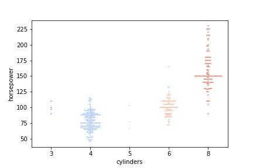

바이올린+Swarm:

sns.violinplot(data=df,x='origin',y='horsepower')
fig=sns.swarmplot(data=df,x='origin',y='horsepower',color='black',size=3)

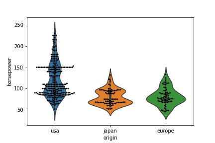

### 실습

Seaborn 시각화.

사용: [seaborn1.ipynb](seaborn1.ipynb)

산점도 행렬:

fig=sns.pairplot(data=df)

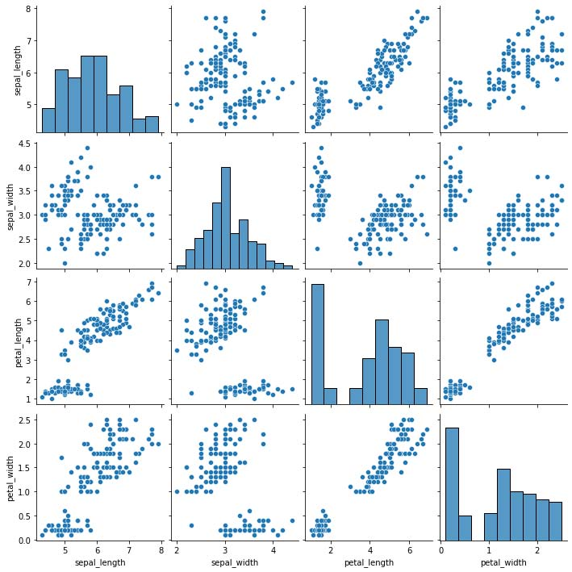

산점도 행렬: 유형을 색상으로 구별.

fig=sns.pairplot(data=df,hue='species')

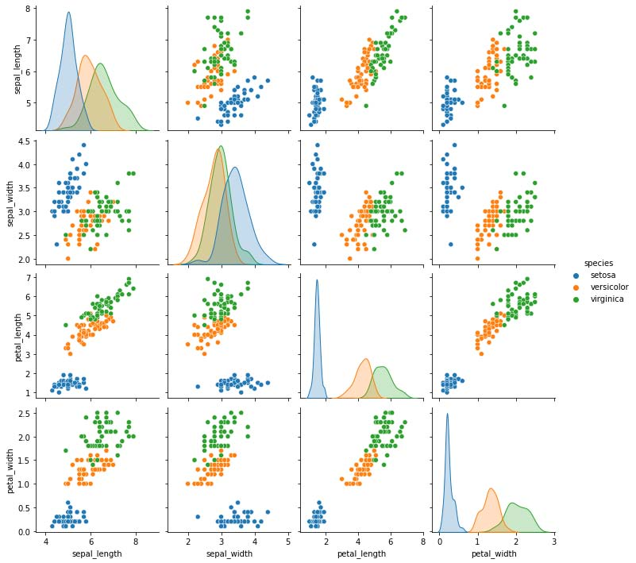

혼종 시각화 행렬:

g=sns.PairGrid(data=df)

g.map_diag(sns.histplot, color='orange')    # 대각선=히스토그램.

g.map_upper(sns,scatterplot, color='green')    # 위 삼각=산점도.

fig=g.map_lower(sns,kdeplot, color='blue')    # 아래 삼각=KDE.

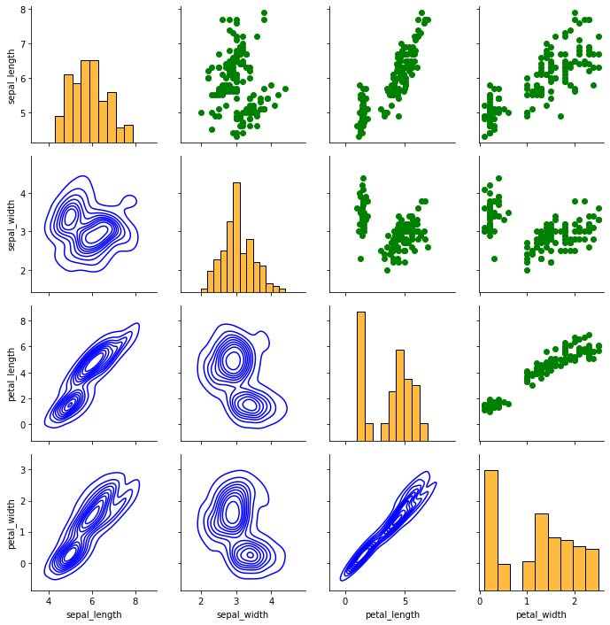

다중 시각화:

g=sns.FacetGrid(data=df,col='species',hue='species')

fig=g.map(sns.histplot,'petal_length')

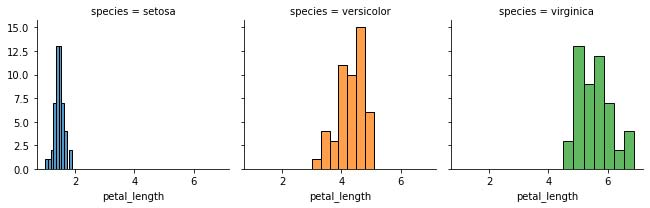

Heatmap:

fig=sns.heatmap(data=x, cmap='coolwarm')

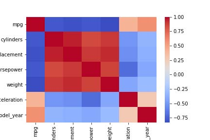

### 실습

Seaborn 시각화

사용: [seaborn2.ipynb](seaborn2.ipynb)

산점도+회귀선

fig=sns.lmplot(data=df,x='weight',y='mpg')

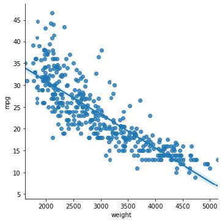

산점도+회귀선:

fig=sns.lmplot(data=df,x='weight',y='mpg',col='origin',hue='origin',markers=['o','v','^'])

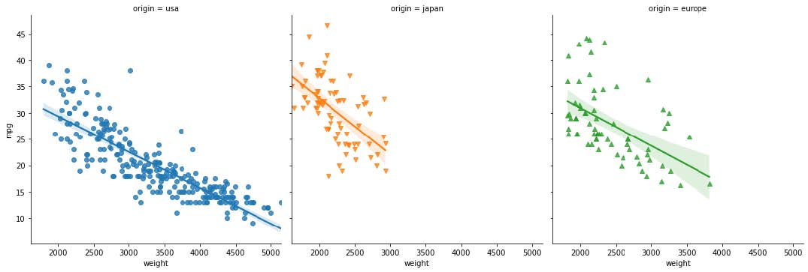

컬러 Palette:

fig=sns.countplot(data=df,x='origin',palette='cubehelix')

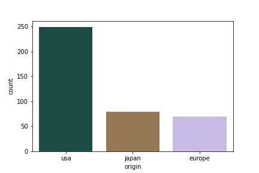

컬러 Palette:

fig=sns.countplot(data=df,x='origin',palette='coolwarm')

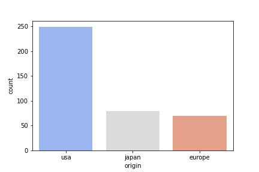

### 실습

Seaborn 시각화

사용: [seaborn3.ipynb](seaborn3.ipynb)
